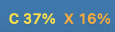
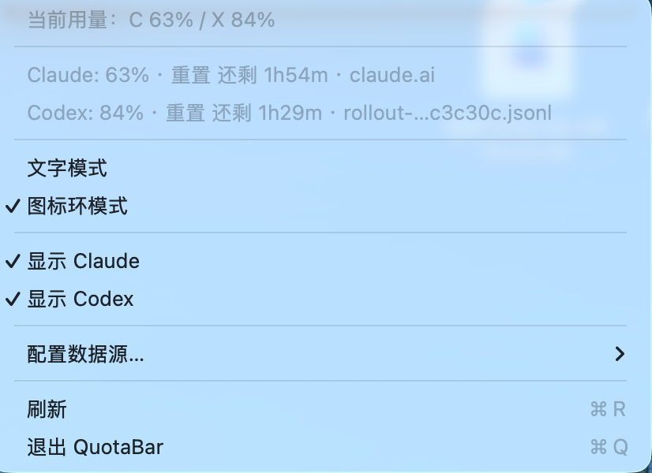

# QuotaBar

<p align="center">
  
</p>

[中文](README.md) | **English**

A lightweight macOS menu bar app that shows real-time usage and reset countdowns for Claude Code and Codex.

---

## Features

- **Two display modes**, switchable from the menu:
  - **Text mode**: shows `C 53%  X 84%` in the menu bar, color-coded by severity
  - **Ring mode**: the brand icon itself is split — bright sector = remaining, dark sector = used
- Text mode can show either **usage %** or **remaining %**
- Menu shows exact percentage + **reset countdown** (e.g. "resets in 1h52m")
- Toggle Claude / Codex display independently
- **Accurate data sources**:
  - Claude: calls `claude.ai/api/oauth/usage` (reuses Claude Code's OAuth token — same data as `/usage` command)
  - Codex: reads `rate_limits` from the latest session JSONL (data from ChatGPT backend responses)
- Configurable data directories and token limits

## Color Rules

| Usage | Color |
|---|---|
| < 50% | 🟢 Green |
| 50 – 79% | 🟡 Yellow |
| 80 – 94% | 🟠 Orange |
| ≥ 95% | 🔴 Red |
| No data | ⚫ Gray |

> Ring mode: bright arc = remaining (green = plenty, red = nearly empty), dark sector = used

## Screenshots

<p align="center">
  
  <br><em>Text mode: C 53%  X 84%, color reflects urgency</em>
</p>

<p align="center">
  
  <br><em>Ring mode: bright sector = remaining, dark sector = used</em>
</p>

<p align="center">
  
  <br><em>Menu: exact percentage + reset countdown</em>
</p>

## Installation

### Build from source (requires Xcode Command Line Tools)

```bash
git clone https://github.com/Shuo-O/QuotaBar.git
cd QuotaBar
chmod +x Scripts/package_app.sh
Scripts/package_app.sh
open build/QuotaBar.app
```

### Development

```bash
Scripts/package_app.sh && open build/QuotaBar.app
```

> `swift run` does not work: macOS only grants a WindowServer GUI session to processes launched via Launch Services from a `.app` bundle. A bare binary can't display menu bar items.

## Configuration

Click the menu bar icon → **Configure Data Sources…**

| Setting | Description | Default |
|---|---|---|
| Claude projects path | Claude Code project files directory | `~/.claude/projects` |
| Codex sessions path | Codex session files directory | `~/.codex/sessions` |
| Claude token limit | 5-hour token budget (used for offline fallback) | 100,000 |

> You can specify a parent directory — the app recursively searches for `.jsonl` files.

## Data Sources

| Service | Primary source | Fallback |
|---|---|---|
| Claude | `claude.ai/api/oauth/usage` (OAuth, no extra setup needed) | Scans `~/.claude/projects/**/*.jsonl`, sums 5h token usage |
| Codex | `rate_limits` field in `~/.codex/sessions/**/*.jsonl` | — |

On first launch, macOS will show a keychain access dialog for Claude. Approve it once.

## Requirements

- macOS 14 (Sonoma) or later
- [Claude Code](https://claude.ai/code) and/or [Codex CLI](https://github.com/openai/codex) installed and signed in

## Icon Credits

- Claude: Simple Icons Claude SVG (MIT License)
- Codex: OpenAI 2025 symbol SVG from Wikimedia Commons
